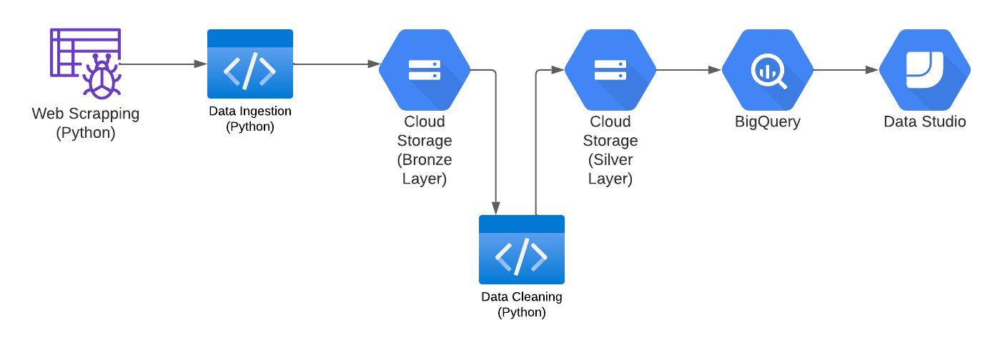

# Pernambuco State Employees Wages Data
The objective is to collect, process and make the data available to
individuals interested in analyzing or generating reports about the State 
expenses with employees.

## Source
The source of data used in this demo was the Pernambuco government open data [website](https://dados.pe.gov.br/dataset/remuneracao-de-servidores).

## Demo Architecture (GCP)
This demo solution was developed with some Google Cloud Platform components. The
complete solution components is showed below:

## Archives
The demonstration archives are:
- [step_01_initial_analysis.ipynb](step_01_initial_analysis.ipynb), a sample dataset initial analysis;
- [step_02_ingestion.py](step_02_ingestion.py), the code with the webscraper and ingestion of raw data into a bucket in GCP (bronze layer);
- [step_03_datalake.py](step_03_datalake.py), the code which reads the raw data in the bucket and make some cleaning. The cleaned data is saved in another place (silver layer);
- [step_04_bigquery.py](step_04_bigquery.py), the code that creates a dataset and a table in BigQuery, loading the silver layer data;
- [step_05_dashboard_sample_looker.md](step_05_dashboard_sample_looker.md), just an example of Google Studio (Looker) usage reading directly BigQuery data. 