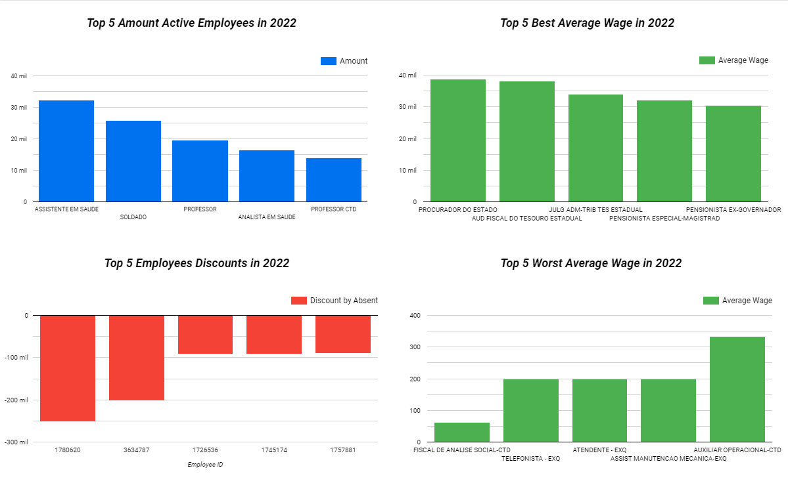

# Sample Dashboard
With the data collected, treated and a BigQuery table created, we can use 
the Google Looker to make some visualizations in order to get insights
about the data. The below example was made connecting the Looker to BigQuery:

